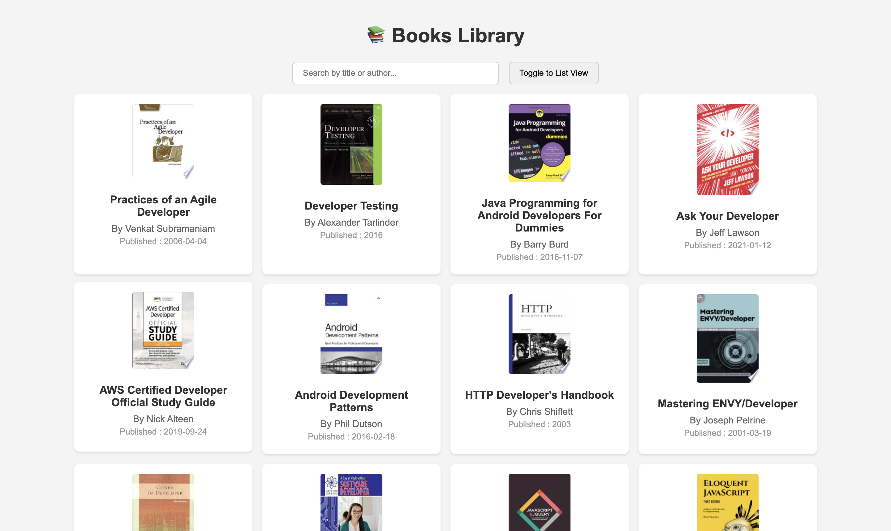

# 📚 Books Library

## Objective
- **Build a user-friendly web application** that fetches and displays books using the FreeAPI.app.
- **Practice dynamic content rendering** using HTML, CSS, and JavaScript.
- **Bonus Features:**  
  - Toggle between List and Grid views.
  - Implement Pagination to load more books seamlessly.

## Features
- **Fetch Books from API:**
  - Retrieves book data from: `https://api.freeapi.app/api/v1/public/books`.
- **Display Book Details:**
  - Shows book title, author, publisher, published date, and thumbnail.
- **View Toggle:**
  - Switch between **List View** and **Grid View**.
- **Search Functionality:**
  - Filter books by title or author using a dynamic search bar.
- **Sort Feature:**
  - Sort books alphabetically by title or by published date.
- **Pagination:**
  - Load more books when the user reaches the end of the current view.
- **Open Details in New Tab:**
  - Clicking a book opens more information in a new tab via `infoLink`.

## Screenshots
### 📌 Grid View

### 📌 List View

## API Endpoint & Documentation
- **API Endpoint:**  
  `https://api.freeapi.app/api/v1/public/books`
- **Documentation:**  
  [View API Docs](https://freeapi.hashnode.space/api-guide/apireference/getBooks)

## Project Structure
- **index.html:**  
  - Base structure with containers for search, sort, view toggler, and books grid/list.
- **styles.css:**  
  - All styling related to responsiveness, layouts, and UI appearance.
- **script.js:**  
  - Logic to fetch API data, handle search, sort, view toggle, pagination, and linking.
- **README.md:**  
  - This documentation file for features, usage, and project info.

## Setup & Installation
- **Clone the Repository:**
  - Execute: `git clone https://github.com/your-username/books-library`
- **Run the Application:**
  - Open `index.html` directly in the browser.

## Deployment
- **Hosting Platform:**  
  - Used Vercel for deployment.
- **Live Link of the Product:**  
  [Try it now!](https://booksy-kappa.vercel.app/)