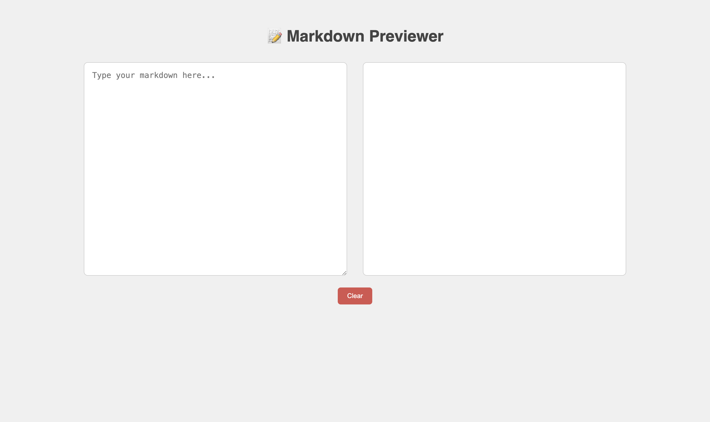

# 📝 Markdown Previewer

## Objective
- **Build a live markdown preview tool** using HTML, CSS, and JavaScript.
- **Enable users to write markdown syntax** and see the preview instantly.
- **Bonus Features:**  
  - Support for code blocks and syntax highlighting.

## Features
- **Markdown Input Panel:**
  - Users type markdown in a textarea on the left.
- **Live Preview Panel:**
  - Rendered markdown is shown in real-time on the right.
- **Basic Markdown Support:**
  - Headings (`#`, `##`, etc.)
  - **Bold** and *Italic*
  - [Links](https://example.com)
  - Ordered and Unordered Lists
- **Reset Button:**
  - Clears the textarea for a fresh start.
- **Bonus Enhancements:**
  - **Code Blocks:** Supports syntax-highlighted inline and multi-line code using `marked.js`.

## Screenshots
### 🧑‍💻 Dual Panel View


## Dependency
- **Marked.js Library:**  
  [https://marked.js.org/](https://marked.js.org/)

## API Endpoint & Documentation
- **No external API used.**  
  All markdown parsing is done locally using the `marked.js` library.

## Project Structure
- **index.html:**  
  Main HTML file containing the textarea for input and the preview container.
- **styles.css:**  
  Handles the layout and responsive styling of both panels.
- **script.js:**  
  Uses `marked` to parse markdown input and render it in real-time.
- **README.md:**  
  Project documentation explaining features, structure, setup, and deployment.

## Setup & Installation
- **Clone the Repository:**
  ```bash
  git clone https://github.com/your-username/markdown-previewer
- **Run the Application:**
  - Open `index.html` directly in the browser.

## Deployment
- **Hosting Platform:**  
  - Used Vercel for deployment.
- **Live Link of the Product:**  
  [Try it now!](https://mdview.vercel.app/)