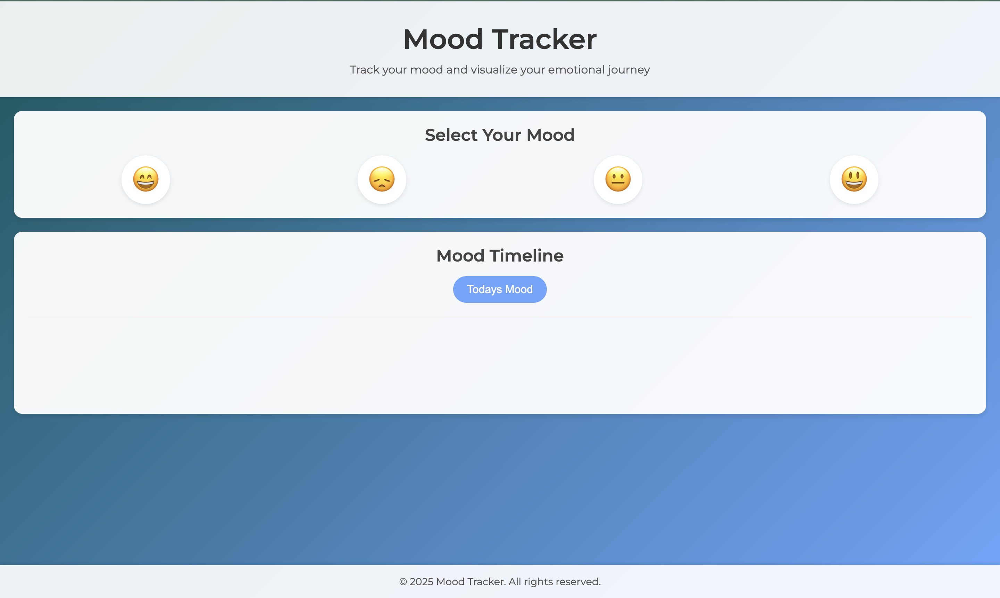

# Mood Tracker

## Objective
- **Purpose:** Build a daily mood tracker that allows users to log their mood and visualize emotional trends.
- **Key Functionality:** Users select a mood emoji for the day, which is saved locally, and later viewed through various timeline formats (daily, weekly, monthly, and optionally a calendar view).

## Features
- **Mood Selection:**
  - Users choose from a set of mood emojis (e.g., happy, sad, neutral, excited).
- **Mood Logging:**
  - The selected mood and current date are stored in LocalStorage for persistence.
- **Timeline View:**
  - Display logged moods in a timeline with options for day, week, and month views.
  - Option to view moods on a calendar.
- **Responsiveness:**
  - Ensure the design adapts seamlessly across mobile and desktop devices.

## Screenshots
### 📌 Homepage View

## Project Structure
- **index.html:**  
  - Main HTML file containing the layout and structure.
- **styles.css:**  
  - Contains all styling rules ensuring the application is visually appealing and responsive.
- **script.js:**  
  - Handles all JavaScript logic including mood selection, data storage (LocalStorage), and rendering the timeline.
- **README.md:**  
  - This file, documenting project details, features, and setup instructions.
- **assets/**
  - Folder for images, icons, or any additional media.

## Setup & Installation
- **Clone the Repository:**
  - Use `git clone <https://github.com/sahil-ladhania/Practice-Projects/tree/main/Mood%20Tracker>` to get started.
- **Run the Application:**
  - Open `index.html` in your preferred browser.
  - Ensure your browser supports LocalStorage.

## Deployment
- **Hosting Platforms:**
  - Used Vercel as Hosting Platform.
- **Live Link of the Product:**
  [Try it now !](https://moodtrack-two.vercel.app/)