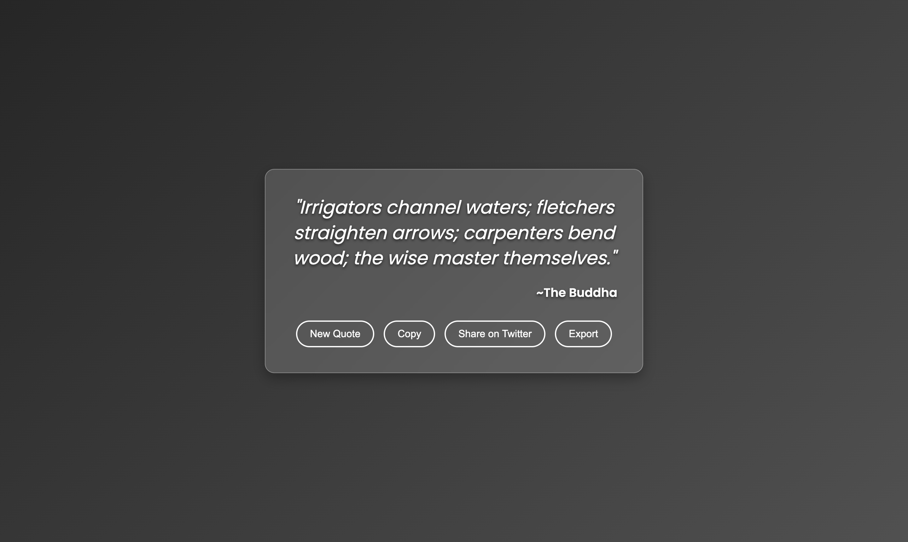

# Quote of the Day

## Objective
- **Build a simple website** that fetches and displays a random quote from an API.
- **Engage users** with interactive features like fetching new quotes, copying quotes, and sharing on Twitter.
- **Bonus Features:**  
  - Display a random background image behind the quote.
  - Provide an option to export the quote image to the user's computer.

## Features
- **Random Quote Fetching:**
  - Retrieves a random quote along with the author from the API endpoint: `https://api.freeapi.app/api/v1/public/quotes/quote/random`.
- **Display Quote:**
  - Shows the fetched quote and its author prominently on the page.
- **New Quote Button:**
  - Allows users to fetch a new quote without refreshing the page.
- **Copy to Clipboard:**
  - Provides a button to easily copy the displayed quote text.
- **Share on Twitter:**
  - Includes functionality to share the current quote on Twitter with a single click.
- **Bonus Enhancements:**
  - **Random Background Image:** Randomly sets a background image behind the quote.
  - **Export Quote:** Enables users to export the quote (as an image) to their computer.

## Screenshots
### 📌 Homepage View

## API Endpoint & Documentation
- **API Endpoint:**  
  `https://api.freeapi.app/api/v1/public/quotes/quote/random`

## Project Structure
- **index.html:**  
  - Main HTML file that structures the page, including containers for the quote, buttons, and background image.
- **styles.css:**  
  - CSS file that handles styling, responsiveness, and the layout of the application.
- **script.js:**  
  - JavaScript file to manage fetching the quote, handling button events (New Quote, Copy, Share, Export), and updating the UI.
- **README.md:**  
  - This documentation file outlining project details, features, and instructions.

## Setup & Installation
- **Clone the Repository:**
  - Execute: `git clone <https://github.com/sahil-ladhania/Practice-Projects/tree/main/Quote%20of%20the%20Day>` to clone the project locally.
- **Run the Application:**
  - Open `index.html` in your web browser.
  - Ensure your browser supports modern JavaScript features and LocalStorage for full functionality.

## Deployment
- **Hosting Platforms:**
  - Used Vercel as Hosting Platform.
- **Live Link of the Product:**
  [Try it now !](https://quotable-tau.vercel.app/)