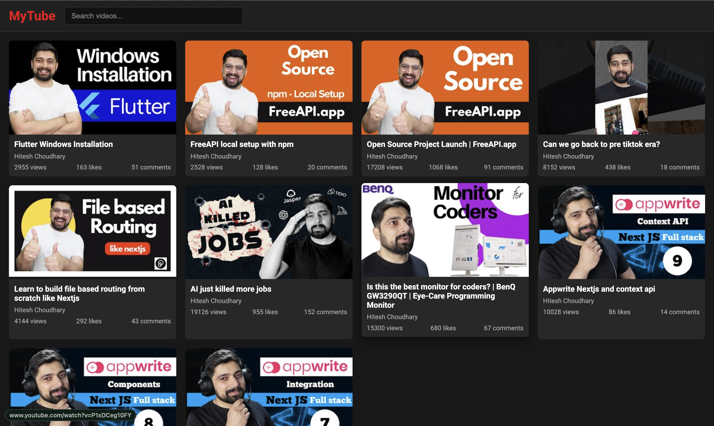
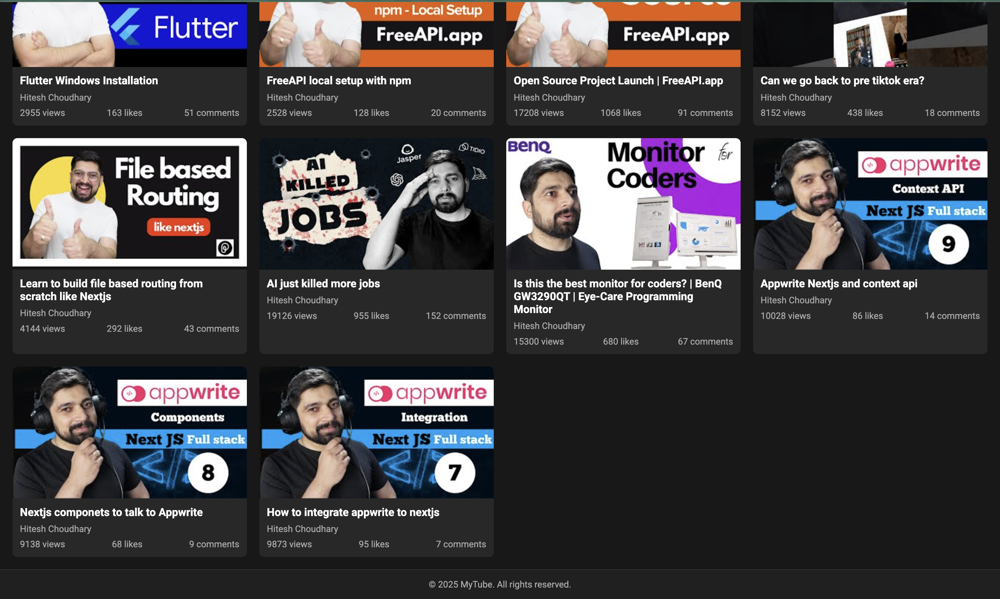

# YouTube Video Listing

## Objective
- **Build a YouTube-style video listing page** that fetches and displays videos from the FreeAPI YouTube endpoint.
- **Provide users with a seamless experience** through features like video thumbnails, titles, and channel names displayed in a grid layout.
- **Enable video search functionality** to filter displayed videos without extra API calls.

## Features
- **Video Data Fetching & Display:**
  - Fetch videos using the API endpoint: `https://api.freeapi.app/api/v1/public/youtube/videos`.
  - Display video thumbnails, titles, and channel names in a grid layout.
  
- **Clickable Video Cards:**
  - Each video card is clickable.
  - Clicking a card opens the corresponding video on YouTube in a `new tab`.
  
- **Search Functionality:**
  - A search bar filters the displayed videos based on user input.
  - Filtering is handled on the frontend without additional API requests.
  
- **Responsive Design:**
  - A responsive grid layout ensures that the application looks great on both mobile and desktop devices.

## Screenshots
### 📌 Homepage View

## API Endpoint
- **GET Request:** `https://api.freeapi.app/api/v1/public/youtube/videos`

## Project Structure
- **index.html:**  
  - Main HTML file containing the structure of the webpage, including the search bar and video container.
- **styles.css:**  
  - CSS file to style the grid layout, video cards, and ensure responsiveness.
- **script.js:**  
  - JavaScript file to handle fetching video data, rendering video cards, and implementing search functionality.
- **README.md:**  
  - Documentation file detailing project objectives, setup instructions, and features.

## Setup & Installation
- **Clone the Repository:**
  - Run `git clone <https://github.com/sahil-ladhania/Practice-Projects/tree/main/YouTube%20Video%20Listing>` to clone the project locally.
- **Run the Application:**
  - Open `index.html` in your preferred web browser.
  - Make sure your browser supports modern JavaScript features for full functionality.

## Deployment
- **Hosting Platforms:**
  - Used Vercel as Hosting Platform.
- **Live Link of the Product:**
  [Try it now !](https://mytube-blue.vercel.app/)